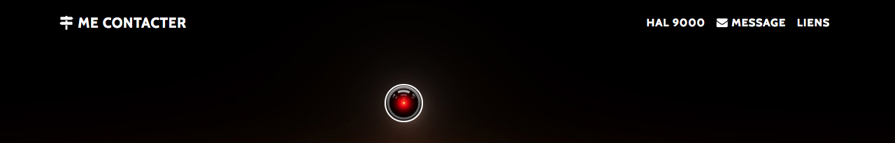

> Espace de Contact

# Contact Panel 🌒 - Historique
## Formulaire Classique ✉️

- Intégration Layout boostrap
- Intégration d'un template style
- styling css/html
- Dev Formulaire de contact
- Formspree methode POST

## Formulaire Ia - HAL 9000

Ajout de l'option Discussion avec HAL 9000

 - Dev du formulaire de conversation HAL 9000
 - modifications Inputs style javascript {en dev}
 - Intégration scripts et application ***Open Source***
  - ***[Conversational Form de SPACE10](https://github.com/space10-community/conversational-form)***
    - ***[📘 DOC](https://space10-community.github.io/conversational-form/docs/0.9.70/getting-started/)***

## MAP et Liens

Intégration API Javascript Google Maps
Obtention de la Google Api key
Styling Map Snazzymaps
Dev buttons liens

## Nav Menu Boutons Sections

Dev icons buttons links

## A VENIR: En dev

(en cours)Récupération des données du premier formulaire
- Code vue.js style front
- (panel_principal) Message onHover sur les Icons
- Ajouts content/média  HAL 9000
- Nouvelle page redirection success form-validation avec Hal

[contact](https://Hotaquet.github.io/)
